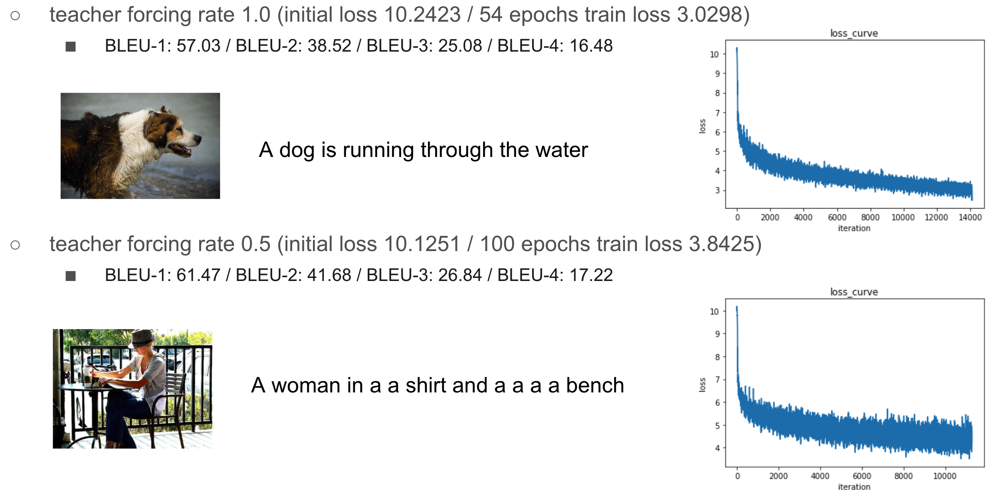

# Show, Attend and Tell (SAT)

PyTorch implementation of the paper 'Show, Attend and Tell'

* Requirements: Python 3, PyTorch
* Dataset: Flickr8k
* Features: Model, Framework agnostic

### Results
* predictions / references : results/...

### References
[1] Xu, K., Ba, J., Kiros, R., Cho, K., Courville, A., Salakhudinov, R., ... & Bengio, Y. (2015, June). Show, attend and tell: Neural image caption generation with visual attention. In International conference on machine learning (pp. 2048-2057).

[2] M. Hodosh, P. Young and J. Hockenmaier (2013) "Framing Image Description as a Ranking Task: Data, Models and Evaluation Metrics", Journal of Artifical Intellegence Research, Volume 47, pages 853-899 (http://www.jair.org/papers/paper3994.html)

[3] parksunwoo, show_attend_and_tell_pytorch, 2018, GitHub repository (https://github.com/parksunwoo/show_attend_and_tell_pytorch)

[4] sgrvinod, a-PyTorch-Tutorial-to-Image-Captioning, 2020, GitHub repository (https://github.com/sgrvinod/a-PyTorch-Tutorial-to-Image-Captioning)

[5] AaronCCWong, Show-Attend-And-Tell, 2019, GitHub repository (https://github.com/AaronCCWong/Show-Attend-and-Tell)
